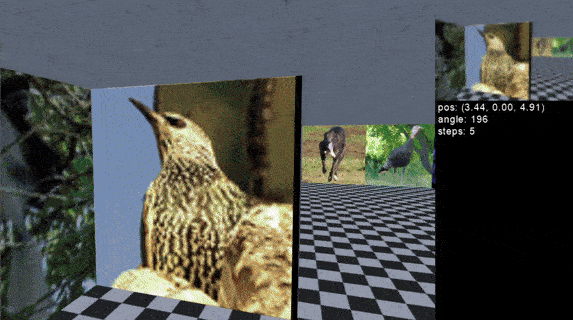
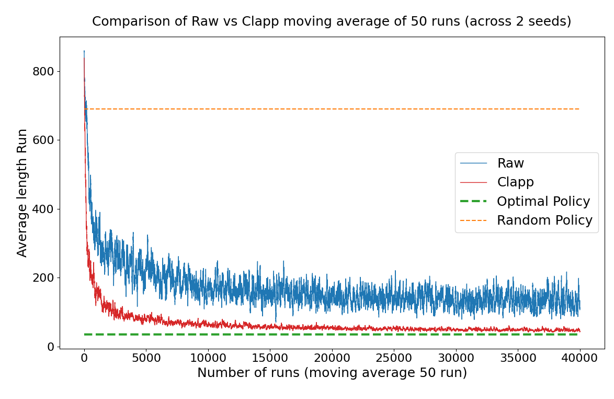
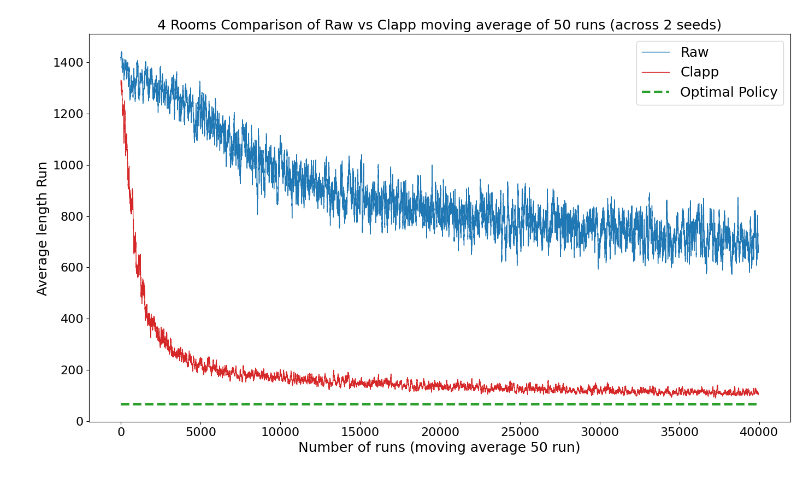
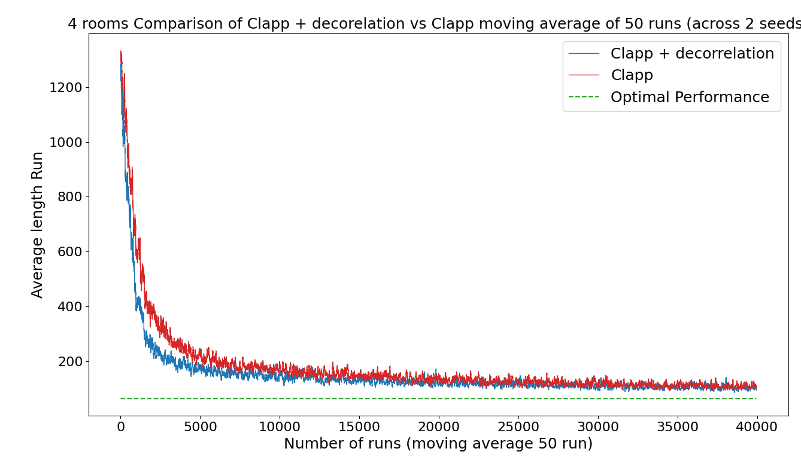

# Spatial navigation using the representation learned from bio-plausible learning rules

This repository corresponds to the code used to do spatial navigation from visual inputs in a bio plausible way.


## Features

- Train an agent to do navigation from visual inputs in a maze 
  - Available algorithms:  
    - [ ] Random policy (baseline)  
    - [ ] Actor-Critic (with bio-plausible updates) 
    - [ ] Actor-Critic with eligibility traces
    - [ ] PPO 
    - [ ] Prioritized sweeping
    - [ ] REINFORCE with a baseline
  - Available encoders
    - [ ] CLAPP (pretrained on stl10) https://github.com/EPFL-LCN/pub-illing2021-neurips 
    - [ ] Resnet50 (pretrained on ImageNet1K)
    - [ ] No encoder (flattened raw pixels)
  - Available environments
    - [ ] T-maze (Minworld) an adaptiation of the T-Maze environment from miniworld with images from the test set of stl10 dataset on the walls 
    - [ ] 4 rooms maze (Minworld) an adaptiation of the 4 rooms environment from miniworld with images from the test set of stl10 dataset on the walls 
    
    - [ ] maze (Minworld) an adaptiation of the Maze environment from miniworld with images from the test set of stl10 dataset on the walls 

- Train a decoder to classify all encoded features from the visual inputs according to a discretization of the maze

- Train an extra encoder layer in order to decorrelate the representation using a mechanism inspired from place cells

## How to run the code 

The list of all arguments is present in the code in [utils/utils.py](utils/utils.py)

To train an agent for a navigation task here is an example of the command to run.
```bash
python main.py  --num_envs 1 --frame_skip 3  --greyscale --algorithm actor_critic_e --track_run
```
### Key arguments
Here is a list of the most relevant arguments.

- environment: which envrionment to use (need to use the full name and path)
- num_envs: the number of environment to run in parallel in order to train our agent
- frame_skip: The number of environment step to run for each agent action
- greyscale: when present the input image is greyscaled 
- task: the task to perform (train the agent for navigation or train an extra layer)
- algorithm: which RL algorithm to use for training
- encoder: which encoder to use
- seed: which seed to use
- encoder_layer: which pretrained extra encoder layer to use (can be none)
- track_run: if true then the run is tracked with MlFlow

## Results

The following section presents the main results obtained and the command the run in order to reach them

### Navigation in T-Maze

#### Comparison CLAPP vs raw pixels


#### command line to reproduce the results (the seeds were 1 and 5):

CLAPP with seed 1:
```bash
python3 main.py --environment envs.T_maze.custom_T_Maze_V0:MyTmaze --max_episode_step 1000 --num_envs 1 --frame_skip 3 --algorithm actor_critic_e --greyscale --encoder CLAPP --actor_lr_i 9e-5 --critic_lr_i 1e-4 --track_run --seed 1
```

Raw with seed 1:
```bash
python3 main.py --environment envs.T_maze.custom_T_Maze_V0:MyTmaze --max_episode_step 1000 --num_envs 1 --frame_skip 3 --algorithm actor_critic_e --greyscale --encoder raw --actor_lr_i 1e-5 --critic_lr_i 2e-5 --track_run --seed 1
```

### Navigation in 4 rooms

#### Comparison CLAPP vs raw pixels


#### command line to reproduce the results (the seeds were 1 and 5):

CLAPP with seed 1:
```bash
python3 main.py --max_episode_step 1500 --num_envs 1 --frame_skip 3 --algorithm actor_critic_e --greyscale --encoder CLAPP --actor_lr_i 9e-5 --critic_lr_i 1e-4 --track_run --seed 1
```

Raw with seed 1:
```bash
python3 main.py --max_episode_step 1500 --num_envs 1 --frame_skip 3 --algorithm actor_critic_e --greyscale --encoder raw --actor_lr_i 1e-5 --critic_lr_i 2e-5 --track_run --seed 1
```

#### Comparison CLAPP vs CLAPP with extra decorrelation layer


#### command line to reproduce the results (the seeds were 1 and 5):


CLAPP with decorrelation (seed 1):
```bash
python3 main.py  --max_episode_steps 1500 --num_envs 1 --frame_skip 3 --encoder_layer pretrained --greyscale --algorithm actor_critic_e  --encoder_model_time time_contrastive_encoder_4rooms_good.pt --encoder_output_mode concatenate --track_run --seed 1
```